<div align="center">


</div>

<br/>

**Qué onda, soy Tkyo.** Me metí en esto a los 11 años, desarmando juegos para entender cómo funcionaban por dentro. De ahí pasé a optimizar Windows hasta dejarlo en los huesos y a escribir scripts para servidores de SA-MP. Nadie me enseñó: aprendí investigando, rompiendo y arreglando.

Hoy mi lado más pulido es la **ciberseguridad**, y mi proyecto principal es [**PlagaSync**](https://plagasync.app), un SaaS para empresas de control de plagas en Colombia que construyo de punta a punta. ¿A dónde voy? A vivir de productos que construyo yo y que le resuelvan problemas reales a gente real.

<br/>

<p align="center">
  
  
</p>


<a href="https://plagasync.app"></a>




<br/>


<p align="center">
  <a href="https://github.com/Tkyoxx/Tkyoxx/issues/new?title=%F0%9F%8F%81%20Entrar%20a%20la%20parrilla&body=Solo%20env%C3%ADa%20este%20issue%20y%20en%20un%20par%20de%20minutos%20aparecer%C3%A1s%20en%20la%20parrilla%20de%20salida.%20No%20hace%20falta%20escribir%20nada%20m%C3%A1s%20%F0%9F%8F%8E%EF%B8%8F"></a>
  <a href="https://discord.com/users/736035241189310465"></a>
</p>

<details>
<summary><b>🔧 Cómo está hecho este perfil</b></summary>

<br/>

Nada aquí es una imagen de plantilla ni un widget de terceros. Cada panel es un SVG animado generado con código propio:

- **`scripts/`**: generador en Node.js sin dependencias. Mide el texto con las métricas reales de cada fuente, recorta las tipografías al mínimo y las incrusta en cada SVG para que se vean igual en cualquier navegador.
- **Animación pura**: CSS y SMIL. El semáforo, el auto que da vueltas al circuito, el team radio escribiéndose y las notas a mano funcionan dentro de un ``, sin JavaScript.
- **Telemetría real**: una GitHub Action consulta la API GraphQL de GitHub cada 8 horas y redibuja las métricas, el lap chart y los sectores mensuales.
- **Parrilla de visitantes**: al abrir el issue, la Action te añade a la parrilla con tu avatar, te da la bienvenida y cierra el issue.

```bash
node scripts/build.mjs
node scripts/build.mjs --live dist
```

</details>


